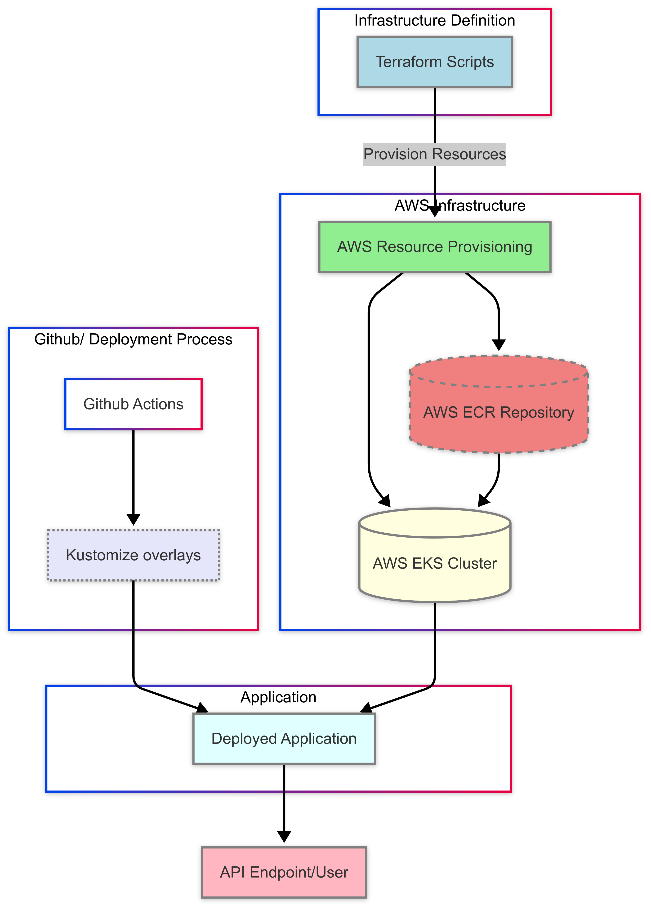

# DevOps Python Application

A simple Python application built for the DevOps technical test, demonstrating best practices in application development, containerization, CI/CD, and infrastructure management. This project leverages Django for the backend API and uses Docker, Kubernetes, and Terraform as part of its deployment pipeline.

---

## Additional Deployment & Testing Considerations

- **Continuous Delivery & Tooling:**  
  For the simplicity of this project, **Kustomize** was chosen for continuous delivery. In more complex projects, you might consider alternative tools such as **Helm** in conjunction with **ArgoCD**, and even extend the approach with **Terraform** for additional infrastructure management.

- **Secret Management:**  
  Secrets are managed through Kustomize and CI/CD by pulling the necessary secrets from GitHub. In larger projects, you could leverage services like **AWS Secrets Manager** to inject secrets directly into EKS.  
  **Local Testing:** Create a `secret.env` file inside the `overlays/development` directory and add the desired secret (e.g., `DJANGO_SECRET_KEY`) before running `kubectl apply -k .`.

- **Python Testing:**  
  Open-source modules were chosen for testing (static code analysis, unit testing, and vulnerability scanning). Although there are additional tools available—including GitHub code analysis and premium options—this demo's tests are configured to block a PR if any of the three core tests fail. The thresholds in this demo have been set conservatively to allow tests to pass with the current state of the code.

- **Infrastructure Deployment:**  
  The infrastructure is deployed on AWS using Terraform. The scripts build an EKS instance and an ECR repository. Community modules were used to create the VPC and EKS cluster, and a custom module was built for the ECR for simplicity. EKS Auto Mode is used for the same reason, and the infrastructure code is included in this repository. In larger projects, it is advisable to separate infrastructure code into its own repository.

- **Ingress Configuration:**  
  The ingress file currently uses `localhost` as the root path. To work in a production environment running on the cloud, you will need a DNS Zone (e.g. Amazon Route 53), and EKS should be configured to use an AWS Load Balancer.

- **Replica Management & AutoScaling:**  
  The requirement for two replicas and auto-scaling is not included in this project. This is because sharing the database among all replicas requires persistent shared storage and additional logic to coordinate running the `migrate` command, which prevents multiple replicas from applying migrations simultaneously. This step is critical in production environments when scaling horizontally.

- **Database Migrations:**  
  The `makemigrations` command is not automated as part of the CI/CD pipeline. Database migrations should be managed manually with each code release and propagated carefully through all environments. In this demo, the `makemigrations` command does not have an effect and is not automatically executed.

---

## Table of Contents

- [DevOps Python Application](#devops-python-application)
  - [Additional Deployment \& Testing Considerations](#additional-deployment--testing-considerations)
  - [Table of Contents](#table-of-contents)
  - [Prerequisites](#prerequisites)
  - [Installation](#installation)
  - [Configuration](#configuration)
  - [Usage](#usage)
    - [Local Deployment with Docker Desktop or Minikube](#local-deployment-with-docker-desktop-or-minikube)
  - [API Endpoints](#api-endpoints)
    - [Create User](#create-user)
    - [Get Users](#get-users)
    - [Get User](#get-user)
  - [**CI/CD Pipeline**](#cicd-pipeline)
  - [Infrastructure](#infrastructure)
    - [Diagrams and Visual Aids](#diagrams-and-visual-aids)

## Prerequisites

- **Python 3.11.3** (or later)
- **Docker** – for containerizing the application
- **Git** – for source code management
- **AWS CLI** – for interacting with AWS services (if deploying to AWS)
- **Kubernetes CLI (kubectl)** – if deploying in a Kubernetes cluster

## Installation

1. **Clone the Repository:**

   ```bash
   git clone https://bitbucket.org/devsu/demo-devops-python.git
   cd demo-devops-python
   ```

2. **Install Dependencies:**

   ```bash
    pip install -r requirements.txt
   ```

3. **Apply Database Migrations:**
   ```bash
    py manage.py makemigrations
    py manage.py migrate
   ```   

## Configuration

- **Environment Variables:**
  Ensure that the required environment variables (such as DJANGO_SECRET_KEY, AWS credentials, etc.) are set via a .env file or in your shell.

- **Database:**
  A SQLite database (db.sqlite3) is generated upon the first run. Adjust file permissions if necessary.

## Usage

- **Run the application locally**
    ```bash
    py manage.py runserver
    ```

    Open http://localhost:8000/api/ in your browser to interact with the API.

- **Run Unit Tests:**
    ```bash
    py manage.py test
    ```

### Local Deployment with Docker Desktop or Minikube

To deploy the application locally using Docker Desktop or Minikube, follow these steps:
1. Build the Docker Image:
   ```bash
   docker build . -t IMAGE-TAG
   ```

   Replace IMAGE-TAG with your desired tag.

2. Deploy via Kubernetes:
   
   Run the following command to use the newly created image:
   ```bash
   kustomize edit set image ${REPOSITORY_NAME}=${REPOSITOY_NAME}:${IMAGE_TAG}
   ```

   Use the Kubernetes overlay for the desired environment (development in the following example) to deploy the application:
   ```bash
   kubectl apply -k ./.infrastructure/kubernetes/overlays/development
   ```
   Note: Ensure that you have created a `secret.env` file inside the overlays/{env} directory with your secrets (e.g., DJANGO_SECRET_KEY) before running this command.

## API Endpoints

### Create User
- Endpoint: `/api/users/`
- Method: `POST`
- Request Body:
    ```json
    {
        "dni": "your-dni",
        "name": "your-name"
    }
    ```

- Success Response (HTTP 200):
    ```json
    {
        "id": 1,
        "dni": "your-dni",
        "name": "your-name"
    }
    ```

- Error Response (HTTP 400):
    ```json
    {
        "detail": "error"
    }
    ```

### Get Users
- Endpoint: `/api/users`
- Method: `GET`
- Response (HTTP 200):
    ```json
    [
        {
            "id": 1,
            "dni": "your-dni",
            "name": "your-name"
        }
    ]
    ```

### Get User
- Endpoint: `/api/users/<id>`
- Method: `GET`

- Success Response (HTTP 200):
    ```json
    {
        "id": 1,
        "dni": "your-dni",
        "name": "your-name"
    }
    ```

- **Not Found (HTTP 404):**
    ```json
    {
        "detail": "Not found."
    }
    ```

## **CI/CD Pipeline**

The project uses GitHub Actions to automate build, test, and deployment tasks:

- **Build and Deploy Workflow:**
    The `build-and-deploy.yaml` file automates the process of building a Docker image with a dynamic tag (combining a timestamp and commit SHA), pushing it to AWS ECR, and updating the Kubernetes deployment using kustomize.
- **Python Test Workflow:** 
    The `python-test.yaml` file runs static code analysis with Pylint, executes unit tests with coverage, and performs vulnerability scanning with Trivy.

## Infrastructure

- **Containerization:**
The Dockerfile defines the steps to package the application into a Docker image (refer to the Dockerfile for details).

- **Kubernetes::**
Kubernetes manifests are managed with a base configuration (.infrastructure/kubernetes/base) and environment-specific overlays (e.g., development overlay under .infrastructure/kubernetes/overlays/development). The overlay uses kustomize to adjust image tags and manage secrets.

- **Terraform:**
Terraform scripts in .infrastructure/terraform are used for provisioning cloud resources such as AWS ECR repositories and EKS clusters.

### Diagrams and Visual Aids

- **Flow Chart**
  ```mermaid
    flowchart TD
        %% Subgraph for Terraform
        subgraph Terraform["Infrastructure Definition"]
            A[Terraform Scripts]
        end

        %% Subgraph for Github
        subgraph Github["Github/ Deployment Process"]
            H[Github Actions] --> E[Kustomize overlays]
        end

        %% Subgraph for AWS Provisioning
        subgraph AWS["AWS Infrastructure"]
            B[AWS Resource Provisioning] --> C[(AWS ECR Repository)]
            B --> D[(AWS EKS Cluster)]
            C --> D
        end

        %% Subgraph for Deployment
        subgraph Application["Application"]
            E --> F[Deployed Application]
            D --> F
        end

        %% Final interaction
        F --> G[API Endpoint/User]

        %% External Connections
        A --> |Provision Resources| B

        style A fill:lightblue,stroke:gray,stroke-width:2px
        style B fill:lightgreen,stroke:gray,stroke-width:2px
        style C fill:lightcoral,stroke:gray,stroke-width:2px,stroke-dasharray: 5 5
        style D fill:lightyellow,stroke:gray,stroke-width:2px
        style E fill:lavender,stroke:gray,stroke-width:2px,stroke-dasharray: 2 2
        style F fill:lightcyan,stroke:gray,stroke-width:2px
        style G fill:lightpink,stroke:gray,stroke-width:2px
  ```

  ```markdown
  
  ```